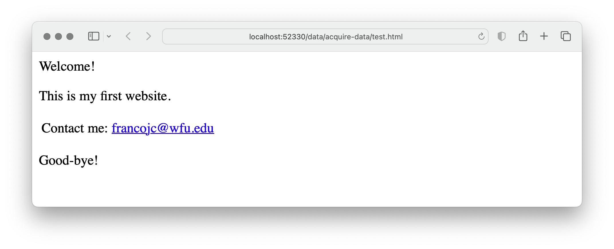

```{r, child="_common.Rmd"}
```

```{r setup, include=FALSE}
knitr::opts_chunk$set(echo = FALSE)
```

There are many resources available through downloads and APIs. There are, however, cases in which you want to acquire data from the public-facing web. R can be used to access the web programmatically through a process known as web scraping. The complexity of web scrapes can vary but in general it requires more advanced knowledge of R as well as the structure of the language of the web: HTML (Hypertext Markup Language).

## HTML: language of the web

HTML is a cousin of XML (eXtensible Markup Language) and as such organizes web documents in a hierarchical format that is read by your browser as you navigate the web. Take for example the toy webpage I created as a demonstration in @fig-example-webpage.

```{r}
#| label: fig-example-webpage
#| fig-cap: 'Example web page.'
#| out.width: '100%'
#| echo: false


```

The file accessed by my browser to render this webpage is `test.html` and in plain-text format as seen in @exm-html-structure.

::: {#exm-html-structure}
```html
<!DOCTYPE html PUBLIC "-//W3C//DTD HTML 4.0 Transitional//EN" "http://www.w3.org/TR/REC-html40/loose.dtd">
<html>
  <head>
    <meta http-equiv="Content-Type" content="text/html; charset=UTF-8" />
    <title>My website</title>
  </head>
  <body>
    <div class="intro">
      <p>Welcome!</p>
      <p>This is my first website.</p>
    </div>
    <table>
      <tr>
        <td>Contact me:</td>
        <td>
          <a href="mailto:francojc@wfu.edu">francojc@wfu.edu</a>
        </td>
      </tr>
    </table>
    <div class="conc">
      <p>Good-bye!</p>
    </div>
  </body>
</html>
```
:::

Each element in this file is delineated by an opening and closing HTML tag, `<head></head>`. Tags are nested within other tags to create the structural hierarchy. Tags can take class and id labels to distinguish them from other tags and often contain other attributes that dictate how the tag is to behave according to Cascading Style Sheet (CSS) rules when rendered visually by a browser. For example, there are two `<div>` tags in our toy example: one has the label `class = "intro"` and the other `class = "conc"`. `<div>` tags are often used to separate sections of a webpage that may require special visual formatting. The `<a>` tag, on the other hand, creates a web link. As part of this tag's function, it requires the attribute `href=` and a web protocol --in this case it is a link to an email address `mailto:francojc@wfu.edu`. More often than not, however, the `href=` contains a URL (Uniform Resource Locator). A working example might look like this: `<a href="https://francojc.github.io/">My homepage</a>`.

::: {.callout}
** Dive deeper**

Cascading Style Sheets (CSS) are used to dictate how HTML elements are rendered visually by a browser. For example, the `div` tag with the class attribute `intro` could be targeted by a CSS rule to render the text in a larger font size and in bold. CSS rules are often written in a separate file and linked to the HTML file. For web scraping purposes, however, we are not interested in the visual rendering of the HTML file, but rather the structure of the HTML file. These tag attributes can provide useful information for parsing HTML files.
:::

The aim of a web scrape is to download the HTML file(s) that contain the data we are interested in. This will include more information that we may ultimately need, but by downloading the raw source HTML we are effectively creating a local archive, or copy, of the webpage. Thus, if the webpage is updated or removed from the web, we will still have access to the data we accessed.

Later in the curation process we will parse (*i.e.* read and extract) target information that is relevant for the research at hand. However, it often useful to parse the raw HTML in the process of acquiring data if we are interested in harvesting data from multiple pages and we would like to use the HTML structure to guide our data extraction (*i.e.* URLs to other pages)

To provide some preliminary background on working with HTML, we will use the toy example above to demonstrate how to read and parse HTML using R. To do this we will use the [rvest](https://CRAN.R-project.org/package=rvest)[@R-rvest] package. First, install/load the package, then, read and parse the HTML from the character vector named `web_file` assigning the result to `html`.

```{r}
#| label: html-toy
#| echo: false

web_file <- '<!DOCTYPE html PUBLIC "-//W3C//DTD HTML 4.0 Transitional//EN" "http://www.w3.org/TR/REC-html40/loose.dtd">
<html>
  <head>
    <meta http-equiv="Content-Type" content="text/html; charset=UTF-8" />
    <title>My website</title>
  </head>
  <body>
    <div class="intro">
      <p>Welcome!</p>
      <p>This is my first website.</p>
    </div>
    <table>
      <tr>
        <td>Contact me:</td>
        <td>
          <a href="mailto:francojc@wfu.edu">francojc@wfu.edu</a>
        </td>
      </tr>
    </table>
    <div class="conc">
      <p>Good-bye!</p>
    </div>
  </body>
</html>'
```

::: {#exm-read-html-toy}
```{r}
#| label: read-html-toy

# Load package
library(rvest) # read and parse HTML

html <- read_html(web_file) # retrieve raw html
html
```
:::

In @exm-read-html-toy `read_html()` retrieves the raw HTML and it makes it accessible to parsing in R. Being a subtype of XML, `read_html()` converts the raw HTML into an object of class `xml_document`, as we can see by calling `class()` on the `html` object in @exm-class-html-toy-class.

::: {#exm-class-html-toy-class}
```{r}
#| label: class-html-toy-class

class(html)
```
:::

An object of class `xml_document` represents each HTML tag as a node. The tag nodes are elements can be accessed by using the `html_elements()` function by specifying the tag/node/element to isolate.

::: {#exm-parse-html-toy-1}
```{r}
#| label: parse-html-toy-1

html |>
  html_elements("div")
```
:::

Notice that the output of @exm-parse-html-toy-1 has returned both `div` tags and their respective children, tags contained within. To isolate one of tags by its class, we add the class name to the tag separating it with a `.`.

::: {#exm-parse-html-toy-2}
```{r}
#| label: parse-html-toy-2
html |>
  html_elements("div.intro")
```
:::

Great. Now say we want to drill down and isolate the subordinate `<p>` nodes. We can add `p` to our node filter, as in @exm-parse-html-toy-3.

::: {#exm-parse-html-toy-3}
```{r}
#| label: parse-html-toy-3

html |>
  html_elements("div.intro p")
```
:::

To extract the text contained within a node we use the `html_text()` function.

::: {#exm-parse-html-toy-4}
```{r}
#| label: parse-html-toy-4

html |>
  html_elements("div.intro p") |>
  html_text()
```
:::

The result of @exm-parse-html-toy-4 is a character vector with two elements corresponding to the text contained in each `<p>` tag. If you were paying close attention you might have noticed that the second element in our vector includes extra whitespace after the period. To trim leading and trailing whitespace from text we can add the `trim = TRUE` argument to `html_text()`, as in @exm-parse-html-toy-5.

::: {#exm-parse-html-toy-5}
```{r}
#| label: parse-html-toy-5

html |>
  html_elements("div.intro p") |>
  html_text(trim = TRUE)
```
:::

With this basic understanding of how to read and parse HTML, we can now turn to a more realistic example.

## Acquire data from the web

### Federalist Papers

Say we investigate the authorship question of the the Federalist Papers following in the footsteps of @Mosteller1963. We want to scrape the text of the Federalist Papers from the Library of Congress website. The main page for the Federalist Papers is located at *https://guides.loc.gov/federalist-papers/full-text* and can be seen in @fig-web-scrape-screenshot.

<!-- screenshot of page to scrape -->

```{r}
#| label: fig-web-scrape-screenshot
#| fig-cap: "Screenshot of the Library of Congress website for the Federalist Papers"
#| out.width: '100%'
#| echo: false

knitr::include_graphics("assets/images/guide-7/fed-papers-loc-main.png")
```

The main page contains links to the text of each of the 85 papers. Our goal will be to scrape and archive the raw HTML for this page and then parse the HTML to extract the links to each of the papers. We will then scrape and archive the raw HTML for each of the 85 papers.

The first step in any web scrape is to investigate the site and page(s) we want to scrape to ascertain if there any licensing restrictions. Many, but not all websites, will include a plain text file [`robots.txt`](https://www.cloudflare.com/learning/bots/what-is-robots.txt/) at the root of the main URL. This file is declares which webpages a 'robot' (including web scraping scripts) can and cannot access. We can use the `robotstxt` package to find out which URLs are accessible ^[It is important to check the paths of sub-domains as some website allow access in some areas and not in others].

<!-- check domain -->

::: {#exm-fed-permissions}
```{r}
#| label: web-permissions

# Install and load package
pacman::p_load(robotstxt)

# URL for the Federalist Papers (LOC)
url <- "https://guides.loc.gov/federalist-papers/full-text"

# Check permissions
paths_allowed(url)
```
:::

<!-- rvest::read_html() -->

The next step is to read and parse the raw HTML. We can do this using the `read_html()` function. 

::: {#exm-fed-read-html}
```{r}
#| label: fed-read-html
#| eval: false

# Read raw html and parse
html <- read_html(url)

# Preview html
html
```
:::

```{r}
#| label: fed-read-html-disk
#| echo: false

data/original/fed_papers/main.html

# Read html from disk to avoid re-scraping
html <- read_html("data/original/fed_papers/main.html")
html
```

At this point we have captured the raw HTML assigning it to the object named `html`. Let's archive the raw HTML to a file in our project directory. We can do this using the `write_html()` function from the `xml2` package [@R-xml2].

::: {#exm-fed-write-html}
```{r}
#| label: fed-write-html
#| eval: false

# Create directory for HTML files
dir_create("../data/original/federalist_papers/")

# Write raw html to file
write_html(html, "../data/original/federalist_papers/main.html")
```
:::

Our update project directory structure can be seen in @exm-fed-project-dir.

::: {#exm-fed-project-dir}
```bash
data/
|── analysis/
├── derived/
└── original/
    └── federalist_papers/
        └── main.html
```
:::

<!-- Scraping URLs -->

Now, we also want to scrape the HTML that contains of the pages corresponding to the 85 Federalist Papers. Perusing the main page we can see that papers are organized into nine groups, *e.g.* "Federalist Nos. 1-10". So our aim will be to scrape the HTML for each of these nine pages. We can do this using the `rvest` package, but we need to identify the HTML elements that contain the URLs first in the main webpage we have in `html`.

<!-- Inspect HTML -->

To do this it is helpful to use a browser to inspect specific elements of the webpage, much as we did in the toy example in @exm-html-structure. To view the raw and displayed HTML, your browser will be equipped with a command that you can enable by hovering your mouse over the element of the page you want to target and using a right click to select "Inspect" (Chrome) or "Inspect Element" (Safari, Brave). This will split your browser window vertical or horizontally showing you the displayed and raw HTML underlying the webpage. 

We can see the HTML elements that contain the URLs in @fig-fed-inspect.

<!-- screenshot of inspecting HTML -->

```{r}
#| label: fig-fed-inspect
#| fig-cap: "Screenshot of the HTML elements containing the URLs for the Federalist Papers"
#| out.width: '100%'
#| echo: false

knitr::include_graphics("assets/images/guide-7/fed-papers-loc-inspect.png")
```

Let's take a closer look at the source HTML in @fig-fed-inspect-source so we can inspect the elements that contain the URLs and divise a strategy for isolating them to be extracted.

<!-- screenshot of inpecting source HTML -->

```{r}
#| label: fig-fed-inspect-source
#| fig-cap: "Screenshot of the source HTML for the Federalist Papers"
#| out.width: '100%'
#| echo: false

knitr::include_graphics("assets/images/guide-7/fed-papers-loc-inspect-source.png")
```


In @fig-fed-inspect-source we can see that the HTML elements that contain the URLs are nested within a `<ul>` element. The `<ul>` element has a set of class attributes (`.s-lg-subtab-ul`, `nav`, `nav-pills`, `nav-stacked`). If one of these is unique to this `<ul>` element we can use it to isolate the element. Let's search the HTML for all the `<ul>` elements on the page. 

::: {#exm-fed-papers-loc-url-ul}
```{r}
#| label: fed-papers-loc-url-ul

html |> 
  html_nodes("ul")
```
:::

The output from @exm-fed-papers-loc-url-ul shows that there are 4 `<ul>` elements on the page. It's a little hard to see in the output, but the second `<ul>` element is the one we are targeting, as it contains the class attributes we identified in @fig-fed-inspect-source. We can use the `html_attr()` function to extract the `class` attribute from the `<ul>` elements to see if one of them is unique to the `<ul>` element we want to isolate.

::: {#exm-fed-papers-loc-url-ul-class}
```{r}
#| label: fed-papers-loc-url-ul-class

html |> 
  html_nodes("ul") |> 
  html_attr("class")
```
:::

Effectively this is the case, as the second `<ul>` element in the output of @exm-fed-papers-loc-url-ul-class has a unique class attribute, `.s-lg-subtab-ul`. We can use this to isolate the element using the `html_nodes()` function. We then pipe this to another `html_nodes()` function to isolate the `<li>` elements nested within the `<ul>` element. See @exm-fed-papers-loc-url-ul-class-s-lg-subtab-ul.

::: {#exm-fed-papers-loc-url-ul-class-s-lg-subtab-ul}
```{r}
#| label: fed-papers-loc-url-ul-li

html |> 
  html_nodes("ul.s-lg-subtab-ul") |> 
  html_nodes("li")
```
:::

Great. Now, to get the URLs we add another `html_nodes()` function to @exm-fed-papers-loc-url-ul-class-s-lg-subtab-ul to isolate the `<a>` elements nested within the `<li>` elements and then a function `html_attr()` to extract the value of an attribute. In this case, the attribute of the `<a>` elements we want is `href`. See @exm-fed-papers-loc-url-ul-li-a. 

::: {#exm-fed-papers-loc-url-ul-li-a}
```{r}
#| label: fed-papers-loc-url-ul-li-a

html |> 
  html_nodes("ul.s-lg-subtab-ul") |> 
  html_nodes("li") |> 
  html_nodes("a") |> 
  html_attr("href")
```
:::

We can assign the URLs to a variable, `fed_urls`.

With the URLs in hand, we can now retrieve the HTML for each of the nine pages. We can, of course, do this manually, as in @exm-fed-papers-rewrite-html-manual.

::: {#exm-fed-papers-rewrite-html-manual}
```{r}
#| label: fed-papers-rewrite-html-manual
#| eval: false

# Read the HTML from the first URL in `fed_urls`
html <- read_html(fed_urls[1])
write_html(html, "../data/original/federalist_papers/fed1.html")

# Read the HTML from the second URL in `fed_urls`
html <- read_html(fed_urls[2])
write_html(html, "../data/original/federalist_papers/fed2.html")

# ... and so on
```
:::

But this is tedious and error prone, furthermore, it doesn't scale well. If we had 1000 URLs to retrieve the HTML from, we would have to write 1000 lines of code. Instead, we can write a function to do this for us. See @exm-fed-papers-rewrite-function.

::: {#exm-fed-papers-rewrite-function}
```{r}
#| label: fed-papers-rewrite-function
#| eval: false

# Function to retrieve HTML from a URL and write to a file
read_write_html <- function(url) {
  # Create a file name and path from the URL
  file_name <- path_file(url) |> path_ext_set(".html")
  file_path <- path("../data/original/federalist_papers/", file_name)

  # Read the HTML from the URL
  html <- read_html(url)

  # Write the HTML to the file
  write_xml(html, file_path)
}
```
:::

The function in @exm-fed-papers-rewrite-function takes a URL as it's only argument. It then creates a file name and path from the URL. The file name is the last part of the URL, with the extension `.html`. The file path is the path to the `federalist_papers` directory in the `data/original` directory. The function then reads the HTML from the URL and writes it to the file.

@exm-fed-papers-rewrite-function might not seem like a step up from @exm-fed-papers-rewrite-html-manual, but it is. We can now use the `walk() ` function from `purrr` to iterate over the URLs in `fed_urls` and apply the `read_write_html()` function to each URL. See @exm-fed-papers-rewrite-map.

::: {#exm-fed-papers-rewrite-map}
```{r}
#| label: fed-papers-rewrite-map
#| eval: false

# Retrieve the HTML from each URL in `fed_urls` and write to a file
fed_urls |> 
  walk(read_write_html)
```
:::

::: {.callout}
** Tip**

When processing multiple webpages, it's often important to manage the load on the server. In R, we can use the `Sys.sleep()` to introduce short delays between requests. This helps reduce server load when iterating over a list of webpages. 

For example, we can use `Sys.sleep(1)` in our function to introduce a 1 second delay between requests. 

```r
read_write_html <- function(url) {
  Sys.sleep(1) # 1 second delay
  # ...
}
```

Another tip is to use the `message()` function to print a status message to the console. This can be helpful when processing a large number of webpages. 

```r
read_write_html <- function(url) {
  Sys.sleep(1) # 1 second delay
  message("Processing ", url) # Prints: "Processing https://www.example.com"
  # ...
}
```
:::

The result of @exm-fed-papers-rewrite-map can be seen in the project directory in @exm-fed-papers-directory. 

::: {#exm-fed-papers-directory}
```bash
data/
|-- analysis/
|-- derived/
└── original/
    └── federalist_papers/
        |-- main.html
        |-- text-1-10.html
        |-- text-11-20.html
        |-- text-21-30.html
        |-- text-31-40.html
        |-- text-41-50.html
        |-- text-51-60.html
        |-- text-61-70.html
        |-- text-71-80.html
        └── text-81-85.html
```
:::

And of course, to finish the acquisition process, we need to ensure we have documented the code and created a data origin file. Since we have created this resource it much of the information will be up to use to document. Keep in mind that the data origin file should be written in a way that is transparent to the researcher and to would-be collaborators and the general research community.

<!-- Summary: tech and help -->

In this section, we have built on previously introduced R coding concepts and employed various others in the process of acquiring data from the web. We have also considered topics that are more general in nature and concern interacting with data found on the internet. As you likely appreciate, web scraping often requires more knowledge of and familiarity with R as well as other web technologies. Rest assured, however, practice will increase confidence in your abilities. I encourage you to practice on your own with other websites. 

## Curate data

### Orientation

To provide an example of the curation process using semi-structured data, we will work with the Federalist Papers data acquired from a web scrape of the Library of Congress website in @sec-acquire-data. The data is stored in a series of HTML files, as seen in @exm-cd-federalist-data-files.

::: {#exm-cd-federalist-data-files}
```bash
data/
├── analysis/
├── derived/
└── original/
    │── fed_papers_do.csv
    └── federalist_papers/
        ├── main.html
        ├── text-1-10.html
        ├── text-11-20.html
        ├── text-21-30.html
        ├── text-31-40.html
        ├── text-41-50.html
        ├── text-51-60.html
        ├── text-61-70.html
        ├── text-71-80.html
        └── text-81-85.html
```
:::

Our data origin file, *fed_papers_do.csv* in @tbl-cd-fed-data-origin, gives us an overview of the data.

```{r}
#| label: tbl-cd-fed-data-origin
#| tbl-cap: "Data origin file for the Federalist Papers dataset."
#| echo: false

read_csv("data/original/fed_papers_do.csv") |> 
  kable() |> 
  kable_styling()
```

From the file structure and the data origin description, we can surmise that we are working with HTML files which will contain the 85 Federalist Papers. The 85 papers are grouped into 9 files, meaning that for each file there will be multiple papers contained within. We can also see that the HTML files are named according to the range of papers contained within each file. For example, the *text-1-10.html* file contains the first 10 papers.

It is also a good idea to inspect the data files themselves. Since these are HTML files, we can open them in a web browser. @fig-cd-federalist-html shows the *text-1-10.html* file opened in a web browser.

```{r}
#| label: fig-cd-federalist-html
#| fig-cap: "The *text-1-10.html* file opened in a web browser."
#| echo: false

knitr::include_graphics("assets/images/guide-7/fed-papers-text-1-10.png")
```

At this point we want to think about what our curated dataset will look like in terms of rows and columns. For the columns, it is helpful to think about what variables we can extract from each of the Federalist Papers. For example, we can extract the paper number, the paper title, the paper's author(s), the venue in which the paper was published, and the paper's text. Of these variables, the paper number, title, and author(s) are metadata about the paper, while the venue is metadata about the publication of the paper, so we will leave venue out of our curated dataset.

For the rows, we can think about what the unit of analysis is. If we want to conduct a text analysis of the Federalist Papers to predict the author of the paper based on features of the text, then the unit of analysis will be the paper. Now, we can envision a case in which each row is a paper, but to may be the case that the structure of the papers, namely the paragraphs, could be of some use to us. We will keep this in mind as we work through the curation process.

With this information in mind, an idealized version of our curated dataset is shown in @tbl-cd-fed-data-idealized.

```{r}
#| label: tbl-cd-fed-data-idealized
#| tbl-cap: "Idealized version of the curated Federalist Papers dataset."
#| echo: false

tribble(
  ~number, ~title, ~author, ~text,
  "1", "...", "...", "...",
  "2", "...", "...", "...",
  "...", "...", "...", "...",
  "85", "...", "...", "..."
) |> 
  kable() |> 
  kable_styling()
```

### Tidy the data

The idealized dataset structure will guide our work. To extract the data and metadata from the files we will need to take a closer look at the structure of the HTML documents. We start with the HTML file we opened in a browser in @fig-cd-federalist-html and look at the HTML source code with the browser's inspect tool. @fig-cd-federalist-html-inspect shows the HTML source code for the first paper in the *text-1-10.html* file.

```{r}
#| label: fig-cd-federalist-html-inspect
#| fig-cap: "The HTML source code for the first paper in the *text-1-10.html* file."
#| echo: false

knitr::include_graphics("assets/images/guide-7/fed-papers-text-1-10-inspect-1.png")
```

The structure of the HTML files suggests that the desired content is within a `div` tag, which forms a kind of box around each paper. There are multiple `div` tags in the file, so we will need to find a way to identify the `div` tag that contains the desired content, and only this content. We can see that the `div` tag we want has two `class` attributes, `s-lib-box s-lib-box-std`. This `div` tag contains a `h2` tag where the paper number appears. The first `p` tag contains the title of the paper. The second `p` tag contains the venue for the paper. The third `p` tag contains the author of the paper. The remaining `p` tags contain the text of the paper. A closer view of the `div` tag is shown in @fig-cd-federalist-html-inspect-2.

```{r}
#| label: fig-cd-federalist-html-inspect-2
#| fig-cap: "A closer view of the `div` tag containing the first paper in the *text-1-10.html* file."
#| echo: false


```

Let's read in the *text-1-10.html* file and use it as a testing ground for extracting the relevant information. Load the `rvest` package and read in the file with `read_html()`, as in @exm-cd-federalist-html.

::: {#exm-cd-federalist-html}
```{r}
#| label: cd-federalist-html-show
#| eval: false

# Load packages
library(rvest)

# Read in the file
fed_file <- "../data/original/federalist_papers/text-1-10.html"
fed_html <- read_html(fed_file)

# Preview
fed_html
```

```{r}
#| label: cd-federalist-html-run
#| echo: false

# Load packages
library(rvest) 
library(xml2)

# Read in the file
fed_file <- "data/original/fed_papers/text-1-10.html"
fed_html <- read_html(fed_file)

# Preview
fed_html
```
:::

Given what we discovered in the HTML inspection, let's extract the `div` tags with the `s-lib-box s-lib-box-std` class attributes. We can use the `html_elements()` function to extract the `div` tags and the append `.s-lib-box.s-lib-box-std` to the `html_elements()` function to specify the class attributes. @exm-cd-federalist-html-div shows the result assigned to an object called `fed_divs`.

::: {#exm-cd-federalist-html-div}
```{r}
#| label: cd-federalist-html-div

# Extract the div tags
fed_divs <- 
  fed_html |> 
  html_elements("div.s-lib-box.s-lib-box-std")

# Preview divs ()
fed_divs |> 
  html_attr("class")
```
:::

Using the `html_attr("class")` function we can see that the `fed_divs` object for this file contains 11 `div` tags, all the `div` tags we want, and one we don't which also includes the `s-lib-floating-box` class. We can exclude it by adding `:not(.s-lib-floating-box)` to the CSS selector. But it is worth checking out one or two other HTML files to see if this is a consistent pattern.

On inspection of other HTML files in our data, it turns out that only our first HTML file has the `.s-lib-floating-box` class. So a CSS solution might not be the way to go. An alternative, R-side solution is to use the `div.s-lib-box`, from above, and then subset the `fed_divs` vector to exclude the first element, which is where the extract `div` tag is located. @exm-cd-federalist-html-div-subset shows the result assigned to an object called `fed_divs`.

::: {#exm-cd-federalist-html-div-subset}
```{r}
#| label: cd-federalist-html-div-subset

# Extract the div tags
fed_divs <- 
  fed_html |> 
  html_elements("div.s-lib-box")

# Remove the first element
fed_divs <- fed_divs[-1]
```
:::

Assuming for the moment that the solution in @exm-cd-federalist-html-div-subset is the way to go, we can move forward to extract the paper number, title, author, and text from each `div` tag in `fed_divs`. We can use the `html_elements()` function to extract the `h2` tag, which contains the paper number, and later work with the `p` tags, which contain the title, author, and text.

We've already isolated the relevant `div` tags, so using the `fed_divs` object we can now continue to use the `html_elements()` function to extract HTML elements within. The paper number is in a `h2` tag, immediately after the `div` tag. We can use the `html_element()` function to extract a single `h2` tag for each `div` in `fed_divs`, as in @exm-cd-federalist-html-h2.

::: {#exm-cd-federalist-html-h2}
```{r}
#| label: cd-federalist-html-h2

# Extract the h2 tag
fed_h2 <- 
  fed_divs |> 
  html_element("h2")

# Preview
fed_h2
```
:::

The result is a vector which contains the `h2` tag for each `div` tag in `fed_divs`, complete with all the HTML tags and attributes. We can use the `html_text()` function to extract the text from the `h2` tag, as in @exm-cd-federalist-html-h2-text. 

::: {#exm-cd-federalist-html-h2-text}
```{r}
#| label: cd-federalist-html-h2-text

# Extract the text from the h2 tag
numbers <- 
  fed_divs |> 
  html_element("h2") |>
  html_text() |> 
  str_trim()

# Preview
numbers
```
:::

I included the `str_trim()` function from the `stringr` package to remove any potential whitespace from the text to the code in @exm-cd-federalist-html-h2-text. The result is a vector of the paper numbers, which we can later leverage to create a new column in our dataset.

Next, we can extract the `p` tags from the `fed_divs` object. The `p` tags contain the title, author, and text. As noted above, the first `p` tag inside each `div` tag contains the paper title. Targeting this `p` tag requires the use of a CSS selector, `:nth-child()`. This CSS selector allows us to arbitrarily select the `p` tag we want in the order it appears. In this case, we want the first `p` tag, so we can use `:nth-child(1)`. @exm-cd-federalist-html-p-title shows the result after extracting the text assigned to an object called `titles`.

::: {#exm-cd-federalist-html-p-title}
```{r}
#| label: cd-federalist-html-p-title

# Extract the title p tags
titles <- 
  fed_divs |> 
  html_elements("p:nth-child(1)") |> 
  html_text() |>
  str_trim()

# Preview
titles
```
:::

::: {.callout}
** Dive deeper**

CSS selectors are a powerful tool for extracting data from HTML files. The `:nth-child()` selector is just one of many. For more information on CSS selectors, see the [W3Schools CSS Selector Reference](https://www.w3schools.com/cssref/css_selectors.asp). The `rvest` package supports many, but not all CSS selectors. Consult the `rvest::html_elements()` documentation for more information. 
:::

We get a vector of length 13, not 10. Scanning the output we can see the most likely offender is the 'PUBLIUS.' text. We can exclude it by adding `:not(:contains("PUBLIUS."))` to the CSS selector, as in @exm-cd-federalist-html-p-title-subset.

::: {#exm-cd-federalist-html-p-title-subset}
```{r}
#| label: cd-federalist-html-p-title-subset

# Extract the title p tags
fed_divs |> 
  html_elements("p:nth-child(1):not(:contains('PUBLIUS.'))") |> 
  html_text() |>
  str_trim()
```
:::

That works, but this solution is 'brittle', meaning that it potentially overspecific and could easily break. For example, if the text of the title happens to include 'PUBLIUS.' it will be excluded. Furthermore, if the extra `p` tag contains some other text other than 'PUBLIUS.' it will be included. 

We can make the solution more robust by looking for a more general solution.  One possibility is to anchor the `p` tags to the `div` tag with the `.clearfix` class that appears directly above (`>`) the `p` tags we want, as in @exm-cd-federalist-html-p-title-subset-2.

::: {#exm-cd-federalist-html-p-title-subset-2}
```{r}
#| label: cd-federalist-html-p-title-subset-2

# Extract the title p tags
titles <- 
  fed_divs |> 
  html_elements("div.clearfix > p:nth-child(1)") |> 
  html_text() |>
  str_trim()

# Preview
titles
```
:::

Now we have our 10 titles. Moving on to the author, we would assume could use the same approach as above changing the `nth-child` argument to 3. However, inspecting the HTML reveals that the author is not always the third `p` tag, sometimes it is the second. What is consistent, however, is that the author is always preceded by the text 'Author:'. We can use the `:contains()` CSS selector to select the `p` tag that contains the text 'Author:'.

::: {#exm-cd-federalist-html-p-author}
```{r}
#| label: cd-federalist-html-p-author

# Extract the author p tags
authors <-
  fed_divs |>
  html_elements("div.clearfix > p:contains('Author:')") |>
  html_text() |>
  str_trim()

# Preview
authors
```
:::

With the result in @exm-cd-federalist-html-p-author, we have now been able to extract the paper number, title and author. Our dataset is taking shape, as we can appreciate in @tbl-cd-federalist-html-dataset-preview.

```{r}
#| label: tbl-cd-federalist-html-dataset-preview
#| tbl-cap: "Preview of the dataset after extracting the paper number, title, and author."
#| echo: false

# Preview of the dataset
tibble(
  number = numbers,
  title = titles,
  author = authors
) |> 
kable() |> 
kable_styling()
```

The last step is to extract the text of the paper. The contents of the papers are contained in the `p` tags that follow the `p` tag with the author. It would be nice to be able to target the `p` tags that follow the author `p` tag. However, there is no CSS selector that allows us to do this. An alternative is to read all the `p` tags in each `div.clearfix` tag and then select the `p` tags that follow the author `p` tag.

This approach requires an additional step. We need to conduct this process for each paper in the HTML file separate

the `str_which()` function to identify the index of the `p` tag that contains the author. We can then use the `str_subset()` function to select all the `p` tags that follow the author `p` tag.

::: {#exm-cd-federalist-html-p-text}
```{r}
#| label: cd-federalist-html-p-text
#| eval: false

# Extract the text p tags

```
:::


```{r}
#| label: extract-text-1

text <- 
  fed_divs[[1]] |> 
  html_elements("div.clearfix p:not(:contains('PUBLIUS'))") |> 
  html_text()

text <- text[-c(1:3)] # remove the first 3 elements

# Preview the first 2 elements
text[1:2] 
```

This gets the text for a single paper within a single `div` tag. We can wrap this in a function and apply it to each `div` tag.

```{r}
#| label: extract-text-2

library(purrr)

extract_text <- function(box) {
  text <- 
    box |> 
    html_elements("div.clearfix p:not(:contains('PUBLIUS'))") |> 
    html_text()
  
  return(text[-c(1:3)])
}

text <- 
  fed_divs |> 
  map(extract_text)
```

Now we can see what the text looks like for the first paper.

```{r}
#| label: extract-text-3

html_tbl <- 
  tibble(
  number = numbers,
  title = titles,
  author = authors,
  text = text
)

html_tbl |> 
  unnest(cols = text)
```

Putting these together for the first HTML file we get the following.

```{r}
#| label: function-extract-content

extract_content <- function(fed_file) {
  html <- read_html(fed_file)
  
  fed_divs <- 
    html |> 
    html_elements("div.s-lib-box")
  
  fed_divs <- fed_divs[-1]
  
  numbers <- 
    fed_divs |> 
    html_elements("h2") |> 
    html_text() |> 
    str_trim()
  
  titles <- 
    fed_divs |> 
    html_elements("div.clearfix > p:nth-child(1)") |> 
    html_text() |> 
    str_trim()
  
  authors <- 
    fed_divs |> 
    html_elements("div.clearfix > p:contains('Author:')") |>
    html_text() |> 
    str_trim()
  
  extract_text <- function(div) {
    text <- 
      div |> 
      html_elements("div.clearfix p:not(:contains('PUBLIUS'))") |> 
      html_text()
    
    return(text[-c(1:3)])
  }
  
  text <- 
    fed_divs |> 
    map(extract_text)

  html_tbl <-
    tibble(
      number = numbers,
      title = titles,
      author = authors,
      text = text
    )
  
  html_tbl <- 
    html_tbl |> 
    unnest(cols = text)

  return(html_tbl)
}
```

We can test this on the first HTML file.

```{r}
#| label: extract-content-test

extract_content(fed_file) |> 
  glimpse()
```

Let's try the fifth HTML file, just to make sure.

```{r}
#| label: extract-content-test-2

fed_file <- "data/original/fed_papers/text-51-60.html"

extract_content(fed_file) |> 
  glimpse()
```

Now we can apply this function to all the HTML files.

```{r}
#| label: extract-content-html-files

fed_files <- 
  dir_ls(path = "data/original/fed_papers/", regexp = "\\btext")

fed_tbl <-
  fed_files |> 
  map_df(extract_content)

glimpse(fed_tbl)
```

We can do some data checks to make sure we have the right number of rows and columns.

```{r}
#| label: data-checks

# Check the number of authors
fed_tbl |>
  group_by(author) |>
  summarize(author_count = n()) |>
  print(n = Inf)

fed_tbl |>
  group_by(number) |>
  summarize(number_count = n()) |>
  print(n = Inf)
```

### Write the data

...
