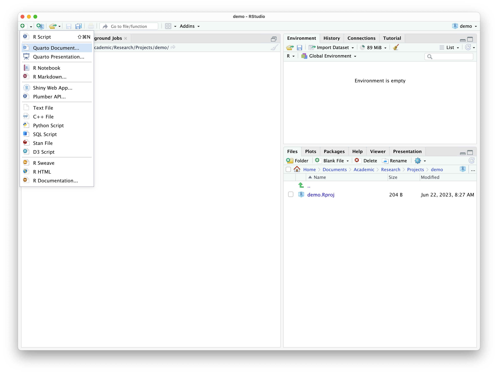
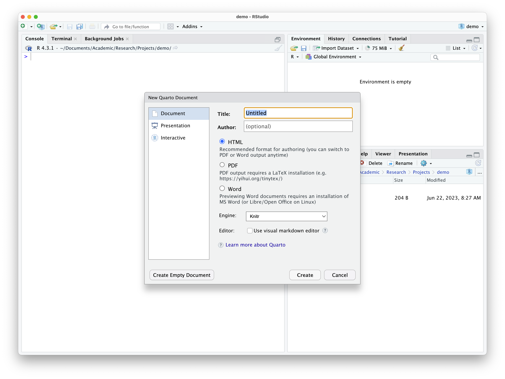
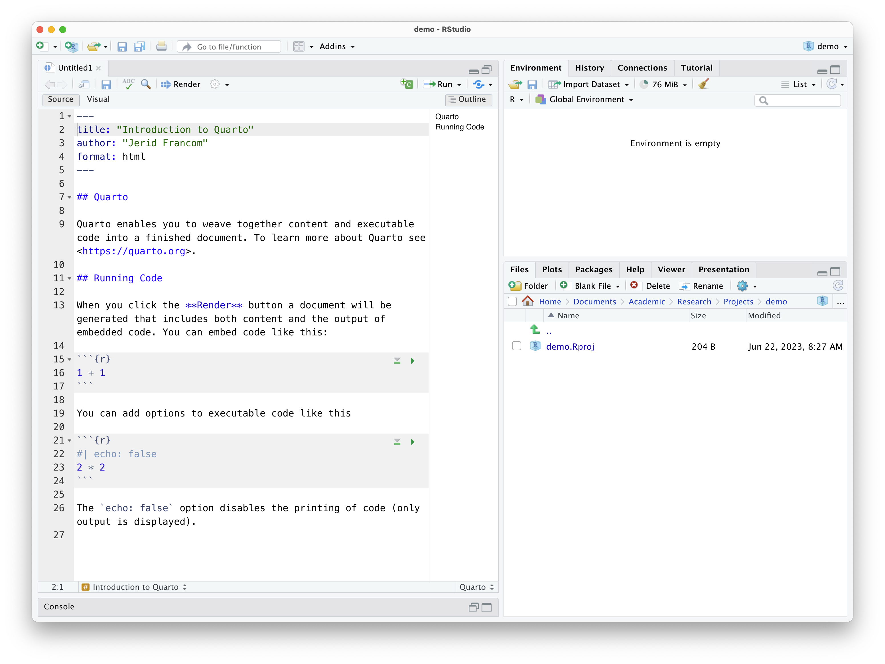

```{r, child="_common.Rmd"}
```

```{r setup, include=FALSE}
knitr::opts_chunk$set(echo = FALSE)
```

## Overview

<!-- Goals for the Recipe/ Lab -->

In this recipe, we will introduce the concept of Literate Programming and describe how to implement this concept through Quarto. I will provide a demonstration of some of the features of Quarto and describe the main structural characteristics of a Quarto document to help you get off and running writing your own documents that combine code and prose.

## Concepts and strategies

### Literate Programming

First introduced by Donald Knuth [-@Knuth1984], the aim of Literate Programming is to be able to combine computer code and text prose in one document. This allows an analyst to run code, view the output of the code, view the code itself, and provide prose description all in one document. In this way, a literate programming document allows for presenting your analysis in a way that performs the computing steps desired and presents it in an easily readable format. Literate programming is now a key component of creating and sharing reproducible research [@Gandrud2015].

### Quarto

[Quarto](https://quarto.org/) is a specific implementation of the literate programming paradigm. In Figure \@ref(fig:image-quarto-preview) we see an example of Quarto in action. On the left we see the Quarto source code, which is a combination of text and code. On the right we see the output of the Quarto source code as an HTML document. 

```{r image-quarto-preview, fig.cap="Quarto source (left) and output (right) example.", fig.alt = "An image with two document views. On the left is Quarto source code and on the right is Quarto HTML output."}
knitr::include_graphics("assets/images/recipe-0/quarto-preview.png")
```

Quarto documents generate various types of output: web documents (HTML), PDFs, Word documents, and many other types of output formats all based on the same source code. While the interleaving of code and prose to create a variety of output documents is one of the most attractive aspects of literate programming and Quarto, it is also possible to create documents with no code at all. It is a very versatile technology as you will come to appreciate. 

::: {.callout}
**`r fontawesome::fa("medal")` Dive deeper**

To see Quarto in action, please check out the [Quarto Gallery](https://quarto.org/docs/gallery/) for a variety of examples of Quarto documents and their output.
:::

A Quarto source document is a plain-text file with the extension `.qmd` that can be opened in any plain text reader. We will be using the RStudio IDE (henceforth RStudio) to create, open, and edit, and generate output from `.qmd` files but any plain-text reader, such as TextEdit (MacOS) or Notepad (PC) can open these files. 

With this in mind, let's now move on to the anatomy of a Quarto document.

#### Anatomy of a Quarto Document

At the most basic level a Quarto document contains two components: 

1. a front-matter section and 
2. a prose section. 

A third component, a code block, can be interleaved within the prose section to add code to the document. Let's look at each of these in turn. 

##### Front-matter

The front matter of a Quarto document appears, well, at the front of the document (or the top, rather). Referring back to Figure \@ref(fig:image-quarto-preview) we see the front matter at the top.   

```yaml
---
title: "Introduction to Quarto"
author: "Jerid Francom"
format: html
---
```

When creating a Quarto document with RStudio the default attribute keys  are `title`, `author`, and `format`. The front matter is fenced by three dashes `---`. 

The values for the first two keys are pretty straightforward and can be edited as needed. The value for the `format` attribute can also be edited to tell the `.qmd` file to generate other output types. Can you guess what value we might use to generate a PDF document? Yep, it's just `pdf`. As we work Quarto you will learn more about how to use the RStudio interface to change some of these key-value pairs and add others!

##### Prose


Anywhere below the front matter and not contained within a code block (see below) is open for prose. The prose section(s) have an added functionality in that they are Markdown aware. What does that mean, you say? Well, Markdown refers to a set of plain-text formatting conventions to produce formatted text in the output document. To quote [Wikipedia](https://en.wikipedia.org/wiki/Markdown):

> Markdown is a lightweight markup language for creating formatted text using a plain-text editor. John Gruber and Aaron Swartz created Markdown in 2004 as a markup language that is appealing to human readers in its source code form. Markdown is widely used in blogging, instant messaging, online forums, collaborative software, documentation pages, and readme files.

What this enables us to do is to add simple text conventions to signal how the output should be formatted. Say we want to make some text **bold**. We just add `**` around the text we want to appear bold. 

```
**bold text**
```

We can also do: 

- *italics* `*italics*`
- [links](http://wfu.edu) `[links](http://wfu.edu)`
- ~~strikethrough~~ `~~strikethrough~~`
- *etc.*

Follow [this link find more information on basic Markdown syntax](https://quarto.org/docs/authoring/markdown-basics.html).

##### Code blocks {#code-blocks}

Code blocks are where the R magic happens. Again, referring to Figure \@ref(fig:image-quarto-preview) we see that there is the following code block.


````
```{r}`r ''`
1 + 1
```
````

A code block is bound by three backticks `` ``` ``. After the first backticks the curly brackets `{}` allow us to tell Quarto which programming language to use to evaluate (*i.e.* run) in the code block. In most cases this will be R, hence the the opening curly bracket `` `{r}` ``. But there are other languages that can be used in Quarto, such as Python, SQL, and Bash.

In the previous example, R is used as a simple calculator adding `1 + 1`. Here's what this code block produces. 

```{r add, echo=TRUE}
1 + 1
```

It is good practice to label your code blocks. In this case we have `` `#| label: add` ``. After this line is where our code will be entered.

````
```{r}`r ''`
#| label: add
1 + 1
```
````

We have only mentioned selecting the coding language and labeling the code block, but [code blocks have various other options](https://quarto.org/docs/computations/r.html) that can be used to determine how the code block should be used. Some common code block options are:

- hiding the code: `#| echo: false`

````
```{r}`r ''`
#| label: add
#| echo: false
1 + 1
```
````

```{r, echo=FALSE}
1 + 1
```

- hiding the output `#| include: false`

````
```{r}`r ''`
#| label: add
#| include: false
1 + 1
```
````

```{r, include=FALSE}
1 + 1
```

- *etc.*

#### Create and render a Quarto document

The easiest and most efficient way to create a Quarto source file is to use the RStudio point-and-click interface. Just use the toolbar to create a new file and select "Quarto Document...", as seen in Figure \@ref(fig:image-quarto-create-1). 

```{r image-quarto-create-1, fig.cap="Creating a new Quarto document in RStudio."}

```

This will provide you a dialogue box asking you to add a title and author to the document and also allows you to select the type of document format to output, as seen in Figure \@ref(fig:image-quarto-create-2). 

```{r image-quarto-create-2, fig.cap="Dialogue box for creating a new Quarto document in RStudio."}

```

Enter a title and author and leave the format set to HTML.

On clicking 'Create' you will get a Quarto document, as in Figure \@ref(fig:image-quarto-create-3), with some default/ boilerplate prose and code blocks. The prose and code blocks can be deleted, and we can start our own document. 

```{r image-quarto-create-3, fig.cap="Quarto source in RStudio."}

```

But for now, let's leave things as they are and see how to generate the output report from this document. Click "Render" in the RStudio toolbar. Before it will render, you will be asked to save the file and give it a name. 

Once you have done that the `.qmd` file will render in the format you have specified and open in the 'Viewer' pane, as seen in Figure \@ref(fig:image-quarto-create-4).

```{r image-quarto-create-4, fig.cap="Quarto source and HTML output side-by-side in RStudio."}
knitr::include_graphics("assets/images/recipe-0/quarto-create-4.png")
```

::: {.callout}
**`r fontawesome::fa('medal')` Dive deeper**

Watch [Getting Started with Quarto](https://www.youtube.com/watch?v=_f3latmOhew) for a guided tour of Quarto [@Cetinkaya-Rundel2023].
:::

## Check your understanding

1. `r torf(TRUE)` Literate Programming, first introduced by Donald Knuth in 1984, allows the combination of computer code and text prose in one document. 
2. The programming paradigm Literate Programming is implemented through `r mcq(c(answer = "Quarto", "R", "RStudio", "GitHub"))`, a platform that facilitates the creation of a variety of output documents based on the same source code.
3. Which of the following components does a basic Quarto document *not* contain? `r mcq(c("Front-matter section", "Prose section", answer = "Back-matter section", "Code block"))`
4. To generate a PDF document in Quarto, you can edit the format attribute value in the front-matter section to `r fitb(c(answer = "pdf"), ignore_case = TRUE)`.
5. `r torf(TRUE)` The code block options `echo` and `include` can be used to hide the code and output, respectively.
6. `r torf(FALSE)` In Quarto, a code block, where the programming language code is entered, is bounded by three underscores (`_`).

## Lab preparation 

This concludes our introduction to literate programming using Quarto. We have covered the basics here but there is much more to explore. 

In preparation for Lab 0, ensure that you have completed the following:

- Setup your computing environment with R and RStudio
- Installed the necessary packages:
  - `quarto`
  - `tinytex`

and that you are prepared to do the following:

- Open RStudio and understand the basic interface
- Create, edit, and render Quarto documents
- Use some basic Markdown syntax to format text

<!-- [ ] possible options for accessing? Github clone and/ or Posit cloud, Dockerfile -->

::: {.callout}

As this is the first lab, I will provide guidance on how to access the lab materials. The lab materials are hosted on GitHub. GitHub is a platform for hosting code and other files. To access the lab materials, you will not need to create a GitHub account, but you may sign up for a free account if you wish[^1]. You will, however, need to verify that Git is installed on your computer, and if not, install it.

[^1]:  Note, if you use an education email (`.edu`) you will be able to advantage of the [Student Education Benefits](https://education.github.com/benefits).

Let's start with Git. 

If you are on a Windows machine, you will most likely need to install Git. [Download and install Git](https://gitforwindows.org/). Go to the "Assests" section of the page and click on the link for the latest `.exe` version. This will download an executable file. Run the executable file and follow the instructions to install Git.

If you are on a Mac, you will first verify that Git is installed. Open the Terminal application (you can search for it using Spotlight). In the Terminal window, type `git --version` and press enter. If Git is installed, you will see a message that says something like `git version 2.43.0`. If you do not see this message, you will need to install Git.

Once you have Git installed, you will need to clone the lab repository. Cloning a repository means that you will download the files from the repository to your computer. To clone the lab repository, follow these steps:

1. You will navigate to [the lab repository on GitHub](https://github.com/qtalr/lab-0) and identify the blue button that says "Code". Make sure that in this dropdown menu you have selected "Clone" and "HTTPS". Copy the URL that appears in the box.
2. Open RStudio and select "New Project..." from the "File" menu. Select "Version Control" and then "Git". Paste the URL you copied from GitHub into the "Repository URL" box. Select a location on your computer where you would like to save the lab materials. Click "Create Project".

This process will create a folder on your computer with the lab materials. You will be able to open and edit the lab materials in RStudio.
:::

With this in mind, you are ready to move on to Lab 0.

## References 